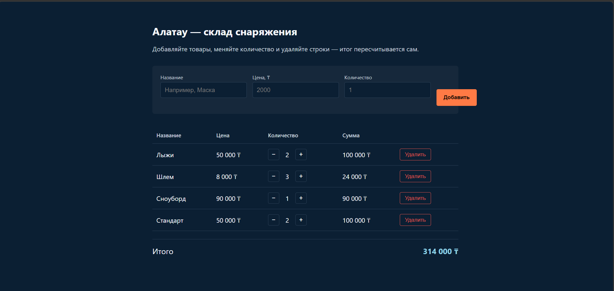

# dom-store-userbaev

Lab 5 — DOM, events, forms. Interactive page built on top of the `Store` class from Lab 4 (plain JavaScript, no frameworks).

## How to open

Just open `index.html` in a browser (double click) — plain HTML, CSS and JavaScript, no build step and no server required.
 ## Project structure

   - `index.html` — page markup and styles
   - `src/store.js` — the `Store` class from Lab 4 with an added `updateQty` method
   - `src/app.js` — rendering, form validation and event handling
## Which events I handled and why

I handle two events in total, each with a single delegated listener instead of one listener per button. The form's `submit` event is handled on the `<form>` itself and takes care of adding a new product after validating the inputs in the DOM (no `alert`). The `click` event is handled once on the `<tbody>` of the table: every row's "+", "−" and "Удалить" buttons share this single listener, which reads `event.target.closest('button')` and the row's `data-name` to know which item and which action to apply. This is event delegation — buttons are created and destroyed when the list re-renders, but the listener itself is attached once to a stable parent, so it keeps working for new rows without re-attaching anything.

## Form validation

The form checks three fields in the DOM and shows the error text under the field instead of using `alert`: the name must not be empty, the price must be greater than zero, and the quantity must be a whole number greater than zero. A product with an already existing name is rejected too.

## Screenshot

## AI tools

Used Claude (Anthropic) to write part of the code. Went through `store.js` and `app.js` myself before submitting so I can explain any part at the defense.
